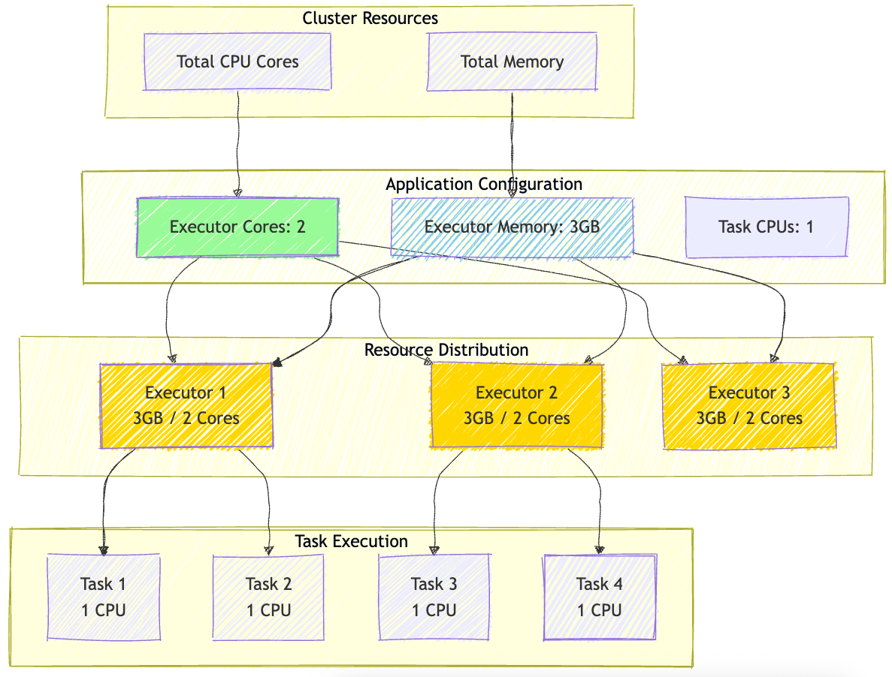
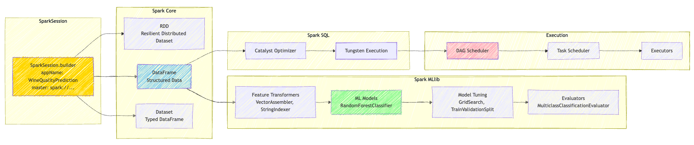
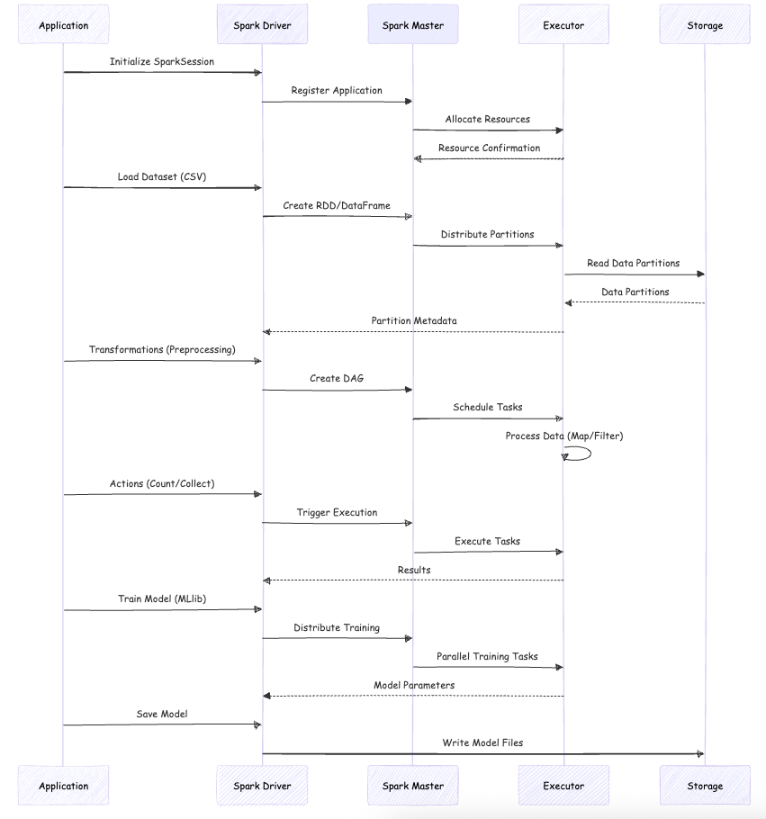

# Spark Wine Predictor - Architecture Diagrams

This directory contains visual diagrams and documentation explaining the Spark architecture, workflow, and system design for the Wine Predictor project.

**Related File:** [spark-architecture.md](diagram/spark-architecture.md)

## Mermaid Diagrams

#### Spark Cluster Resources

Visual representation of Spark cluster resource allocation, showing how CPU cores, memory, and executors are distributed across worker nodes in the cluster.

#### Spark Components Workflow

 Detailed workflow diagram showing how different Spark components interact during application execution, including data flow, transformations, and ML pipeline stages.

#### Spark Execution Model

**Description:** Sequence diagram illustrating the execution model of Spark applications, showing the interaction between the driver, master, executors, and storage layer.

**Key Components:**
- Driver-Master communication
- Task scheduling and distribution
- Executor task execution
- Data partition management
- Result aggregation

## Related Documentation

For more information about the project structure and implementation:
- [README.md](../README.md) - Project setup and usage instructions
- [python/](../python/) - Python implementation
- [scala/](../scala/) - Scala implementation
- [docker/](../docker/) - Docker configuration files
