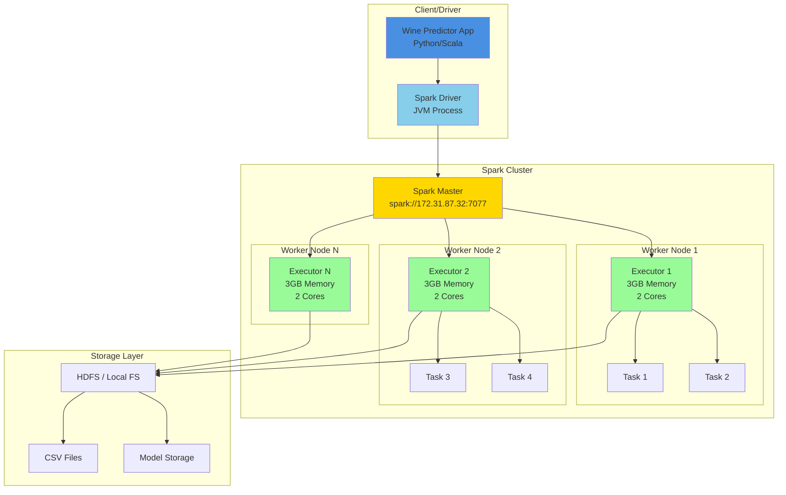
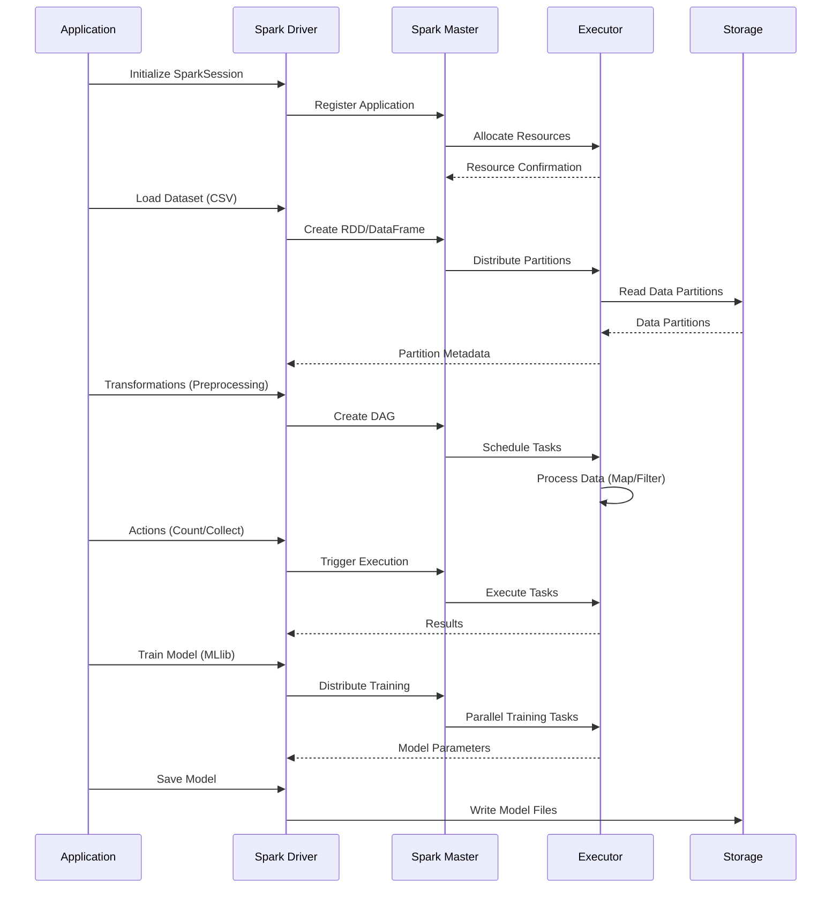
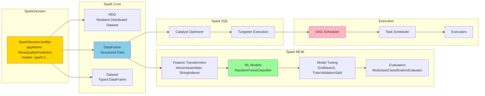
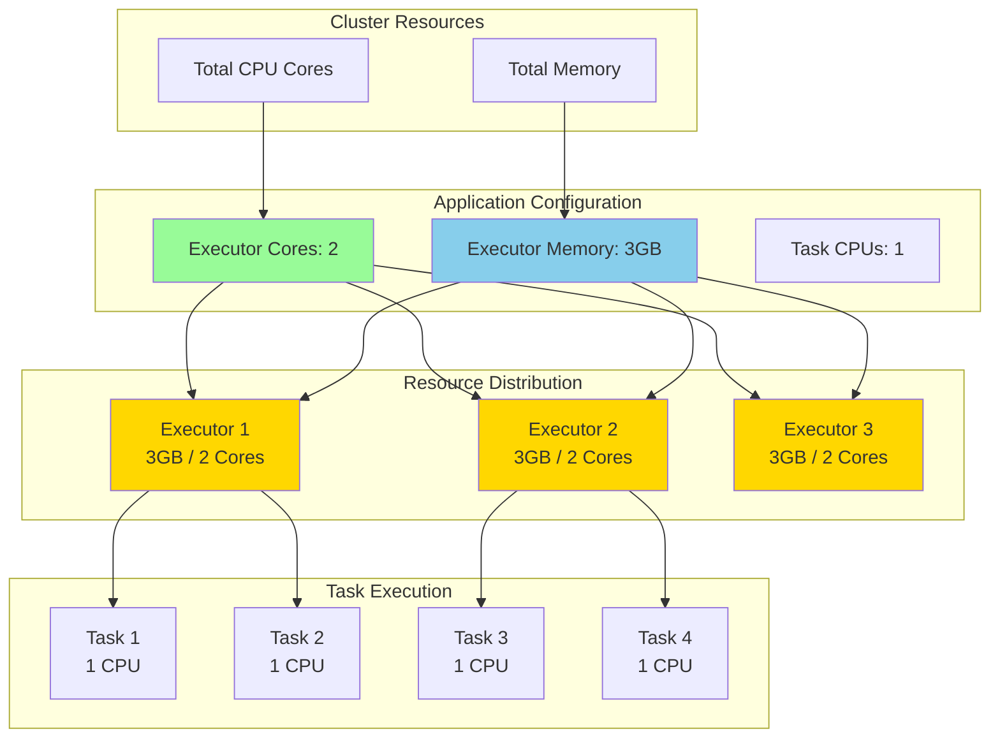

# Spark Architecture Diagrams

## Spark Cluster Architecture



## Spark Execution Model



## Spark Application Components



## Spark Resource Allocation



## Spark Job Execution Stages

```mermaid
gantt
    title Spark Job Execution Timeline
    dateFormat X
    axisFormat %s
    
    section Stage 1: Data Loading
    Read CSV Files           :0, 5s
    Create Partitions       :5s, 3s
    
    section Stage 2: Transformations
    Clean Columns           :8s, 2s
    Vector Assembly         :10s, 4s
    String Indexing         :14s, 3s
    
    section Stage 3: Data Processing
    Oversampling            :17s, 10s
    Data Splitting          :27s, 2s
    
    section Stage 4: Model Training
    Grid Search Setup       :29s, 2s
    Parallel Training       :31s, 60s
    Model Evaluation        :91s, 5s
    
    section Stage 5: Model Saving
    Save Best Model         :96s, 4s
```

